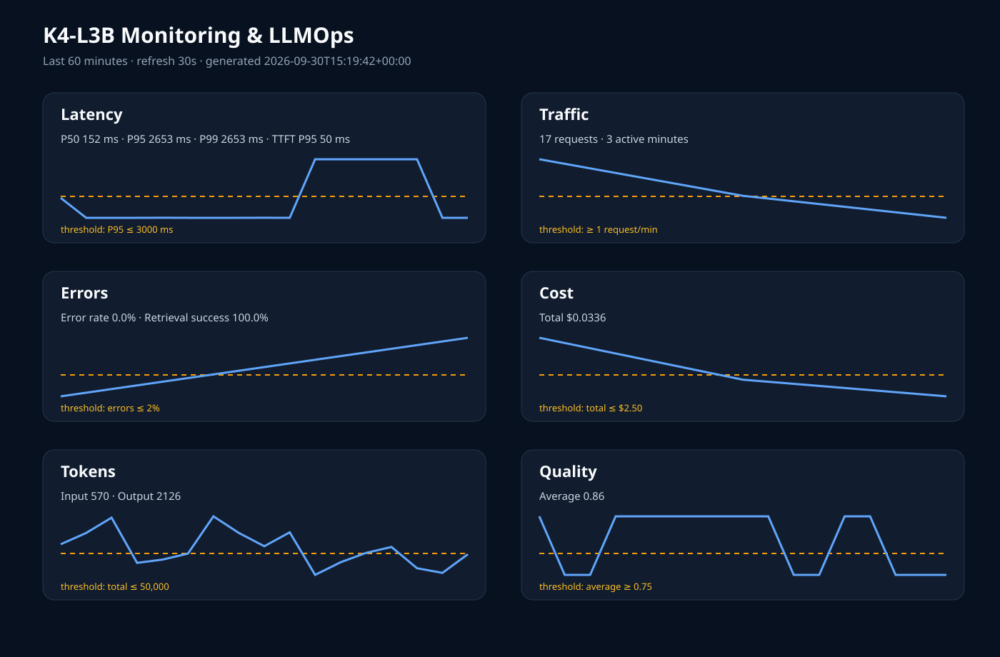

# Báo cáo cá nhân — K4-L3B Day 13 Monitoring & LLMOps

> Mỗi học viên hoàn thiện một file duy nhất này. Khi dẫn evidence, dùng đường dẫn tương đối, ví dụ `evidence/07-trace-waterfall.png`.

## 1. Thông tin học viên

- **Họ và tên:** Đào Trọng Khang
- **MSSV:** 2A202602974
- **Lớp:** K4-L3B
- **Repository URL:** https://github.com/khangdaotr/4-L3-DAY13-DaoTrongKhang-2A202602974-Monitoring-LLMOps
- **Commit SHA cuối:** `20731681b90c983c0be87e9cb6f3c92b6eab57ed` (commit nền trước khi hoàn thiện submission; cập nhật theo `git log -1` khi tạo commit nộp cuối)
- **Challenge ID:** `day13-k4-l3b-monitoring-llmops-v1`
- **Tên project Langfuse cá nhân:** `day13-k4-l3b-2A202602974`

## 2. Evidence index

Điền đúng đường dẫn tới evidence thực tế. Có thể đổi tên hoặc dùng nhiều ảnh nếu cần.

| Evidence | Đường dẫn |
|---|---|
| Pytest cuối | [01-pytest.txt](evidence/01-pytest.txt) |
| Log validator | [02-log-validator.txt](evidence/02-log-validator.txt) |
| Dashboard validator | [03-dashboard-validator.txt](evidence/03-dashboard-validator.txt) |
| Structured log | [04-structured-log.txt](evidence/04-structured-log.txt) |
| PII redaction | [05-pii-redaction.txt](evidence/05-pii-redaction.txt) |
| Trace list | [06-trace-list.txt](evidence/06-trace-list.txt) |
| Trace waterfall | [07-trace-waterfall.txt](evidence/07-trace-waterfall.txt) |
| Trace metadata | [08-trace-metadata.txt](evidence/08-trace-metadata.txt) |
| Prompt versions | [09-prompt-versions.txt](evidence/09-prompt-versions.txt) |
| Prompt rollback | [10-prompt-rollback.txt](evidence/10-prompt-rollback.txt) |
| Dashboard runtime | [11-dashboard-overview.svg](evidence/11-dashboard-overview.svg) |
| Incident metric | [12-incident-metric.txt](evidence/12-incident-metric.txt) |
| Incident log | [13-incident-log.txt](evidence/13-incident-log.txt) |
| Incident trace | [14-incident-trace.txt](evidence/14-incident-trace.txt) |

## 3. Kết quả kỹ thuật

| Nội dung | Baseline | Kết quả cuối | Nhận xét |
|---|---|---|---|
| `validate_logs.py` | 30/100 | 100/100 | Không thiếu field/enrichment; 0 PII leak |
| `validate_dashboard.py` | 6/6 panel hợp lệ | 6/6 panel hợp lệ | Contract và dashboard runtime đủ sáu panel |
| `pytest` | 22 passed | 24 passed | Chạy với Python 3.12.14 |
| Số traces hợp lệ | Chờ xác nhận trên Langfuse UI | 14 trace đủ cây trong 15 phút | Xác nhận bằng Observations API v2 |
| Số PII leak | 0 | 0 | Validator quét email, điện thoại VN, CCCD và thẻ |
| Latency P95 / TTFT P95 | 1000 ms / 50 ms | 2653 ms / 50 ms trong challenge | Dùng `latency_ms` phía server, không dùng client queue time |
| Retrieval success rate | 100% | 100% | Tính trên mọi event có `tool_success`; challenge là chậm, không lỗi |

## 4. Logging và PII

- **Cách tạo/nhận và truyền correlation ID:** Middleware xóa context cũ ở đầu request, nhận `x-request-id` hoặc sinh `req-` + 8 ký tự hex, bind vào structlog contextvars, truyền vào metadata trace và trả lại trong response header.
- **Các metadata được ghi vào structured log:** `ts`, `level`, `service`, `event`, `correlation_id`, `user_id_hash`, `session_id`, `feature`, `model`, `env`; response còn có latency, TTFT, token, cost, quality và trạng thái tool.
- **Cách bảo đảm PII được scrub trước khi ghi:** `scrub_event` chạy trước file processor và JSON renderer, duyệt đệ quy mọi string trong record. User ID chỉ được lưu dưới dạng SHA-256 rút gọn 12 ký tự.
- **Cách kiểm chứng kết quả:** Request `req-a1b2c3d4` chứng minh context xuyên suốt; request `req-e5f6a7b8` chứa bốn loại PII giả và log chỉ còn các token `[REDACTED_*]`. Validator đạt 100/100, 0 PII leak.

## 5. Tracing và prompt versioning

- **Cách xác nhận traces do chính tôi tạo trong project cá nhân:** Lọc theo session và đối chiếu `correlation_id` với `data/logs.jsonl`; Observations API v2 xác nhận 14 trace đủ cây trong 15 phút.
- **Cấu trúc root/retrieval/generation observations:** `lab-agent-run` (agent) có hai child là `retrieval` (retriever) và `generation` (generation). Generation ghi model, usage, cost và managed prompt.
- **Cách nối trace với log:** Metadata trace chứa cùng `correlation_id` được middleware bind vào mọi log của request.
- **Prompt name:** `day13-chat`
- **Version/label baseline:** version 1, labels `baseline` và `production` sau rollback.
- **Version/label candidate:** version 2, labels `candidate` và `latest` sau rollback.
- **Trace ID của mỗi version:** v1/baseline `d81392944601b16e567f9c21be2f8363`; v2/candidate `7161710ee8c0b007a271c11d12821a76`; v2/production sau promote `56393eff993a5ceeb26a6a2a4435faa4`; v1/production sau rollback `2ff1f4bb021ea1074bf9466a7d3a0ca4`.
- **Cách promote và rollback `production`:** Gán `production` cho v2 để promote, restart và gửi request; sau đó gán lại `baseline, production` cho v1, restart và xác nhận trace rollback có `prompt_version=1`.

## 6. Dashboard, SLO và alerts

- **Dashboard và sáu panel:** `evidence/11-dashboard-overview.svg`, dựng từ `data/logs.jsonl`, time range 60 phút, gồm Latency, Traffic, Errors, Cost, Tokens và Quality với threshold trên từng panel.
- **SLO và lý do chọn:** 99.5% request trong 28 ngày phải thành công và có latency không quá 3000 ms. Baseline khoảng 0.4–1.0 giây nên 3000 ms có dư địa tail latency nhưng vẫn phát hiện suy giảm rõ.
- **Cách tính error budget:** 100% - 99.5% = 0.5%; với 10,000 request thì tối đa 50 request được phép lỗi hoặc chậm hơn 3000 ms.
- **Ba alert và runbook tương ứng:** `HighLatencyP95` (>3000 ms/5m), `HighErrorRate` (>2%/5m), `LowAnswerQuality` (<0.75/10m), gửi Slack `#k4-l3b-alerts`; runbook tại `docs/alerts.md#alert-1`, `#alert-2`, `#alert-3`.

> Ví dụ cách viết error budget: "SLO 99.5% trong 28 ngày nghĩa là error budget 0.5%. Nếu workload có 10,000 request thì tối đa 50 request được phép lỗi hoặc chậm hơn ngưỡng SLO."

## 7. Điều tra challenge

- **Challenge ID:** `day13-k4-l3b-monitoring-llmops-v1`
- **Khoảng thời gian điều tra:** `2026-09-30T15:11:39Z`–`15:11:52Z` (UTC), tương ứng `22:11:39`–`22:11:52` giờ Việt Nam.
- **Triệu chứng từ metrics:** Năm request monitoring đều có latency server 2652–2653 ms, vượt threshold 2000 ms; baseline P50 là 152 ms. TTFT P95 vẫn 50 ms, error rate 0%, retrieval success 100%, nên đây là tăng latency chứ không phải lỗi hoặc generation chậm.
- **Log line và correlation ID liên quan:** `response_sent` lúc `15:11:41.823352Z`, `correlation_id=req-7c5b8fa6`, `latency_ms=2652`, `ttft_ms=50`, `tool_name=retrieval`, `tool_success=true` ([evidence](evidence/13-incident-log.txt)).
- **Trace ID và span gây ảnh hưởng:** Trace `d1d1439804172869207e3722e98113db`; root `c803065ac0994858`, retrieval child `c8e7d4ac2e782b99`, generation child `82f0bcbe8e9d7092`. Span bị ảnh hưởng là `retrieval` ([evidence](evidence/14-incident-trace.txt)).
- **Root cause:** Challenge bật scenario `rag_slow`, bổ sung khoảng 2.5 giây ở bước retrieval; mức tăng từ baseline ~152 ms lên ~2652 ms khớp với delay này, trong khi TTFT/generation và error rate không đổi.
- **Fix action:** Tắt `rag_slow` bằng `python scripts/inject_incident.py --scenario rag_slow --disable`, xác nhận `/health` trả mọi incident `false`, rồi chạy lại workload.
- **Preventive measure:** Duy trì alert `HighLatencyP95`, dashboard tách latency/TTFT, child span retrieval/generation và runbook bắt buộc đi theo Metrics → Logs → Trace trước khi rollback hoặc thay đổi hệ thống.

> Gợi ý cách viết ngắn, không thay cho evidence thực tế: "Metric cho thấy `[latency/error/cost/quality]` bất thường trong `[khoảng thời gian]`. Log line `[event]` có `correlation_id=[...]` đại diện cho request bị ảnh hưởng. Trace cùng `correlation_id` cho thấy span `[retrieval/generation/prompt/tool]` có dấu hiệu `[chậm/lỗi/token tăng]`. Root cause là `[nguyên nhân suy ra từ evidence]`. Fix action là `[hành động khôi phục]`; preventive measure là `[alert/runbook/test/guardrail để ngăn tái diễn]`."

## 8. Giải thích và tự đánh giá

- **Một quyết định kỹ thuật quan trọng và lý do:** Dùng `contextvars` tại middleware làm nguồn duy nhất cho correlation ID, nhờ đó log của handler và metadata của mọi observation tự động nhất quán ngay cả khi nhiều request chạy đồng thời.
- **Một lỗi/blocker đã gặp:** `uvicorn --reload` gây lỗi named pipe trong môi trường Windows sandbox; endpoint trace cũ của Langfuse trả HTTP 410; trình điều khiển browser không có cửa sổ khả dụng.
- **Cách tìm nguyên nhân và xử lý:** Chạy API không `--reload`, dùng Langfuse Observations API v2 thay endpoint cũ, chờ batch exporter trước khi đọc trace, và lưu kết quả API dạng text thay vì tạo screenshot giả.
- **Cách hiểu luồng Metrics → Logs → Traces:** Metrics xác định loại triệu chứng và cửa sổ thời gian; log chọn request cụ thể qua `correlation_id`; trace cùng ID chỉ ra child span chịu ảnh hưởng. Chỉ sau ba bước mới kết luận root cause.
- **Vai trò của prompt version, token/cost, SLO hoặc rollback trong vận hành LLM:** Prompt label cho phép promote/rollback mà không sửa code; token/cost giúp phát hiện phình prompt hoặc output; SLO biến kỳ vọng latency thành ngưỡng đo được và error budget; rollback là mitigation nhanh khi candidate làm chất lượng vận hành xấu đi.
- **Điều quan trọng nhất đã học:** Observability hữu ích khi metric, log và trace dùng chung định danh và dữ liệu an toàn; từng tín hiệu riêng lẻ chưa đủ để kết luận nguyên nhân.
- **Hạn chế hoặc phần chưa hoàn thành, nếu có:** Evidence Langfuse hiện là output `.txt` từ Observations API vì không có browser automation khả dụng; trước khi nộp nên bổ sung ảnh UI 06–10 và 14 có tên project/time range. Commit SHA cần cập nhật sau commit nộp cuối.

## 9. Checklist trước khi nộp

- [ ] Kết quả và evidence thuộc commit SHA cuối (cập nhật sau commit nộp).
- [x] Tất cả ảnh/output mở được bằng đường dẫn tương đối.
- [x] Incident evidence nối đúng metric → log → trace.
- [x] Trace/prompt evidence thuộc project Langfuse cá nhân và không lộ secret.
- [x] Repository chạy lại được theo README.
- [x] Không có secret, API key, PII thô hoặc evidence của người khác/lớp khác.
- [ ] URL repo và commit SHA cuối đã được nộp trên LMS/Codelabs.
